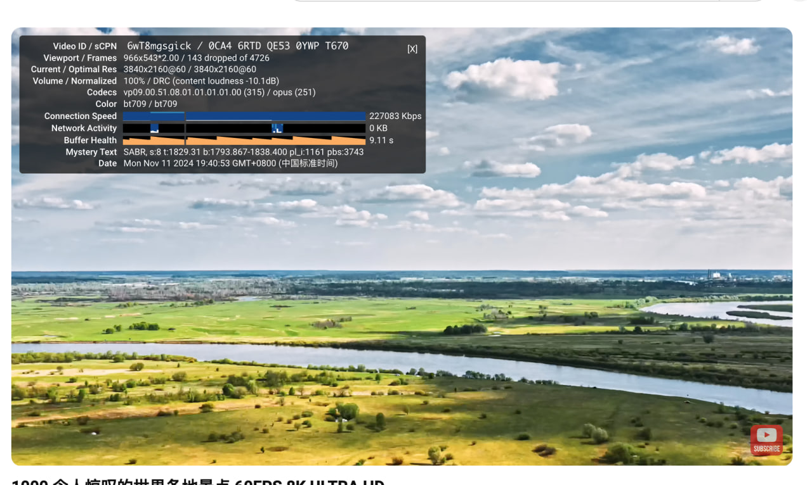
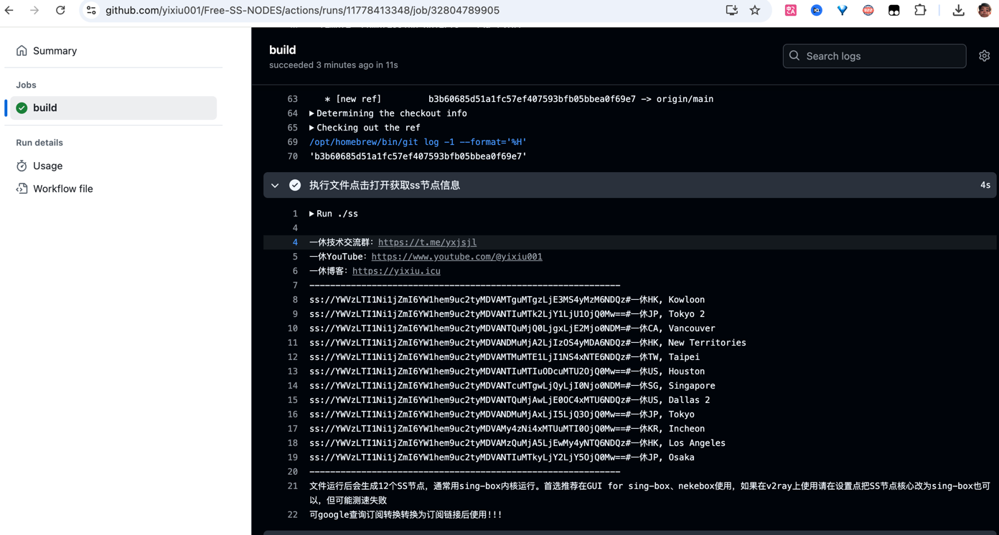

# 免费获取ss节点
文件运行后会生成12个SS节点，通常用sing-box内核运行。首选推荐在GUI for sing-box、nekebox使用，如果在v2ray上使用请在设置点把SS节点核心改为sing-box也可以，但可能测速失败
速度杠杠的，跑20w稳稳当当

### 一、点个Star，然后点击Fork
`Star!!!Star!!!Star!!!`
### 二、开启工作流
在Actions那里开启
### 三、在工作流执行完成之后可以在build种找到ss节点如下图：

### 四、使用订阅转换转换一下就可以放到singbox中使用了，非常简单！！！